# Little Explorers - A Holiday Recommendation Website by Karen Samad

**** device image *****

Little Explorers is a user-friendly website dedicated to effortlessly browsing and recommending child-friendly holiday destinations. Searching through the recommendations is simplified with an intuitive filter mechanism. Users possess the capability to view, edit, and delete their recommendations effortlessly, while also having the convenience to contact the site's administrators for any inquiries. Furthermore, the site is fortified against malicious content through a "report a post" feature, enabling users to flag inappropriate content, which administrators can promptly review and remove as necessary.

This project is my third Milestone Project as part of the Code Institute's Diploma in Web Application Development. 

---

**** table of contents *****

---

## User Experience Design

Applying UX design principles, I carefully considered the essential features needed by both site owners and users to foster engagement and mutual benefits, resulting in a functional, user-friendly website.

### **Strategy Plane**

#### Site Goals

- To give users the opportunity to find child friendly holidays in the UK.

- To generate revenue from an integrated e-commerce site selling child-related holiday equipment. 

#### User Stories

1. As a user, I want to be able to:

    -  Find what I’m looking for on the site easily and intuitively from the home page and navigation bar. 
    - View the site any device and for the site to be responsive.
    - View and filter holiday recommendations posted by other users.
    - Contact the site owners to suggest a new holiday type, ask questions or report a malicious recommendation.
    - Return to the home page without having to use my browser buttons. including when I navigate to a non-existent page or I’m thrown an error.

2. As a user without an account, I want to be able to:

    - Understand the purpose of the site from the home page
    - Set up an account so I can create my own recommendations.

3. As a user with an account, I want to be able to:

    - Sign into my account.
    - Add my own holiday recommendation using a user-friendly form.
    - View my previously posted holiday recommendations.
    - Edit/Delete recommendations I have posted.
    - Comment on holiday recommendations, adding information about a holiday destination and verifying the post.
    - Log out of my account easily. 

4. As an administrator I want to be able to:

    - Sign into my account quickly and easily.
    - Edit any recommendation if necessary.
    - Add a new holiday type category.
    - Edit a new holiday type category.
    - Delete a user if necessary.
    - Receive email messages from the site users. 
    - Log out of my account easily. 

--- 

### **Scope Plane**

The following opportunity matrix summarises the key features that could be implemented on Little Explorers and the difficulty/viabitliy of each feature. The opportunities will be developed based on their priority scores.

#### **Table 1 Opportunity Summary**

| **Opportunity**                                                                               | **User**       | **Inportance** | **Viability** | **Score** |
|-----------------------------------------------------------------------------------------------|----------------|----------------|---------------|-----------|
| All pages - Navbar                                                                            | All            | 5              | 5             | 10        |
| All pages - Footer containing social links, contact, copyright and disclaimer                 | All            | 5              | 5             | 10        |
| Homepage - brand and explanatory text                                                         | All            | 5              | 5             | 10        |
| Homepage - Showcase of some recommendations                                                   | All            | 5              | 5             | 10        |
| Recommended holiday main page - Showcase of recommendations + Map showing holiday desinations | All            | 5              | 3             | 8         |
| Recommended holiday main page - Map with clickable links                                      | All            | 5              | 2             | 7         |
| Filter function to find tailored recommendations                                              | All            | 5              | 3             | 8         |
| Contact Page                                                                                  | All            | 5              | 5             | 10        |
| Sign In Functionality                                                                         | All            | 5              | 5             | 10        |
| Create Account Functionality                                                                  | All            | 5              | 5             | 10        |
| Sign Out Functionality                                                                        | Signed In User | 5              | 5             | 10        |
| Passowrd reset Functionalitliy                                                                | Signed In User | 3              | 1             | 4         |
| Profile Page with user's own recommendations + edit/delete options                            | Signed In User | 5              | 5             | 10        |
| User add Recommendation Page                                                                  | Signed In User | 5              | 5             | 10        |
| User edit Recommendation Page                                                                 | Signed In User | 5              | 5             | 10        |
| Holiday Recommendation Full Page information with map                                         | Signed In User | 5              | 4             | 9         |
| Ability to Report a Recommendation                                                            | Signed In User | 4              | 4             | 9         |
| Ability to rent child-related holiday equipment from the site                                 | Signed In User | 2              | 2             | 4         |
| Admin profile page with options to add/edit recommendations and holiday types                 | Admin Only     | 5              | 5             | 10        |
| Manage Holiday Type Page (with edit/delete links)                                             | Admin Only     | 5              | 5             | 10        |
| Add Holiday Type Page                                                                         | Admin Only     | 5              | 5             | 10        |
| Edit Holiday Type Page (with delete button)                                                   | Admin Only     | 5              | 5             | 10        |
| User search function                                                                          | Admin Only     | 4              | 3             | 7         |
| Delete user functionalitly                                                                    | Admin Only     | 4              | 4             | 8         |
| Custom Error Pages                                                                            | All            | 5              | 3             | 8         |

### Stucture Plane

Based on the [User Stories](README.md#user-stories) and the opportunities outlined in [Table 1](README.md#table-1-opportunity-summary) the following structure was planned for the site. 

This site map outlines the design of the website and which pages are accesible to which user. 

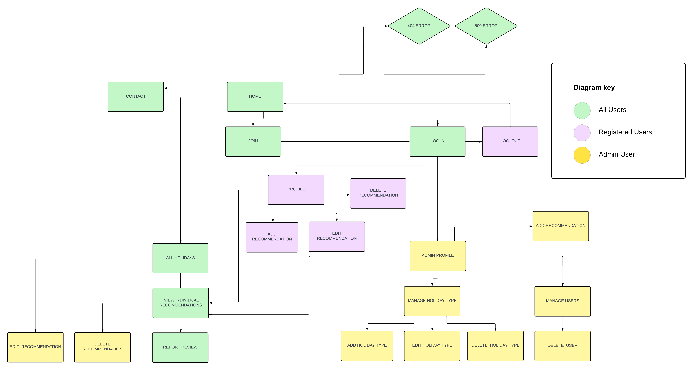

This table outlines the design for the PostgreSQL database used to store the data, a relational database.

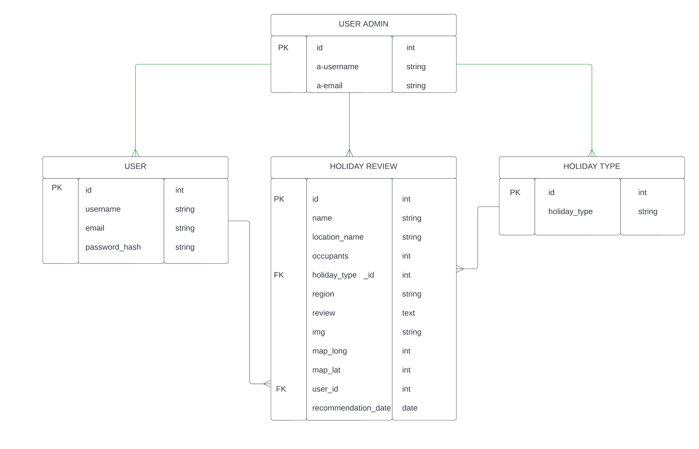

I will also Flask, a templating language to dynamically generate HTML content within my application. Flask's templating engine allows me to embed Python code directly into HTML templates, enabling me to build dynamic and interactive web pages that combine static HTML with dynamic content generated by my Python backend. As a result my css and js will be within a static folder. 

I'll also use SQLAlchemy, an ORM (Object-Relational Mapping) tool integrated with Flask, to interact with the database. SQLAlchemy simplifies database operations by providing a Pythonic interface, allowing me to define models using Python classes and perform CRUD operations within my Flask application.

### Skeleton Plane

#### Wireframes

The following wireframes were created to outline the content for each page and demonstrate its responsive behavior across different devices.

I've opted to expand the display of the mobile and tablet designs to ensure thorough planning of content placement, accounting for the constraints of these devices.

All pages will consist of a logo and navigation bar, enabling users to navigate to different sections of the site. The logo or title will serve as a link back to the homepage.

Additionally, each page will feature a footer providing links to social media platforms, a site disclaimer, and a contact link for reaching the site administrators.

The content on each page is customised to its specific purpose but maintains a consistent design language across all pages, ensuring seamless flow and enhancing the user experience. Further details about the features on each page are outlined in the ????????[finished site]()section below. 

Home Page

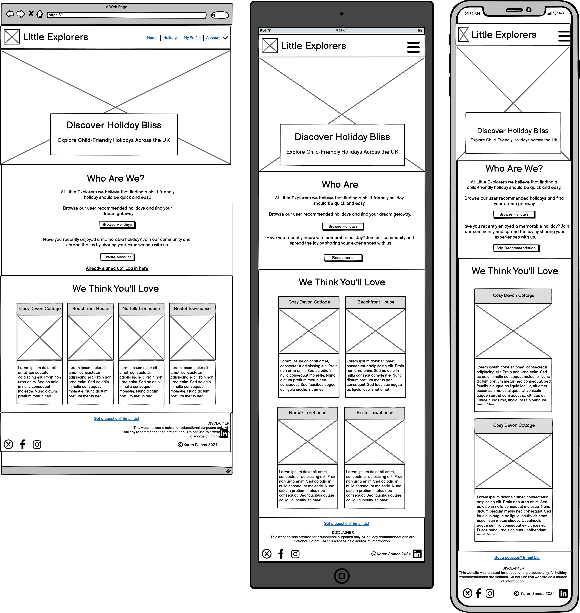

Create Account

 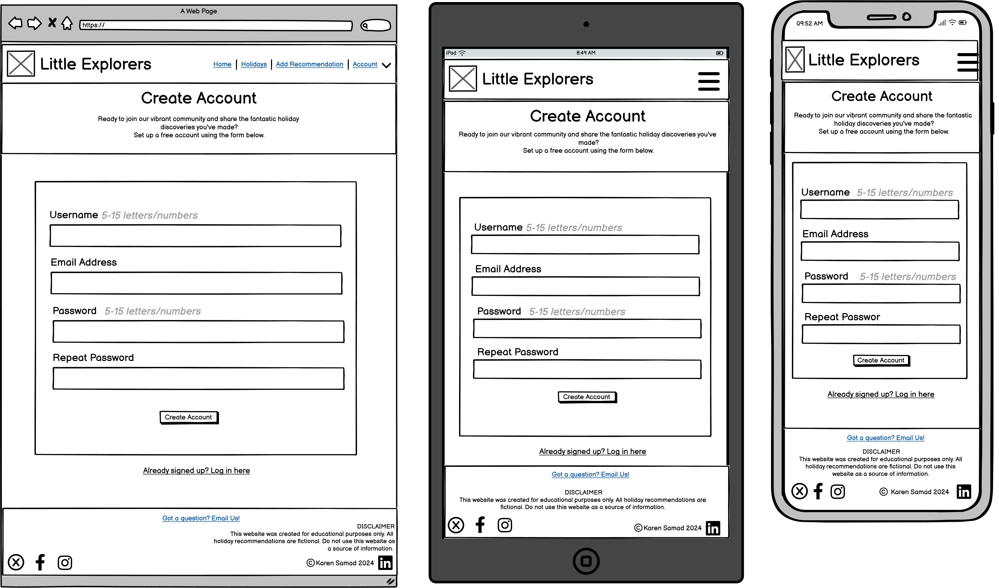

Sign In

 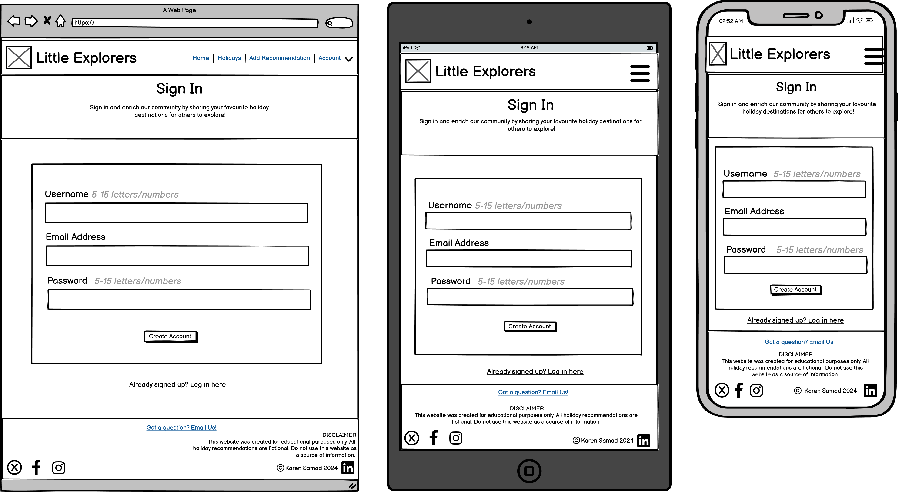

Recommendations Gallery

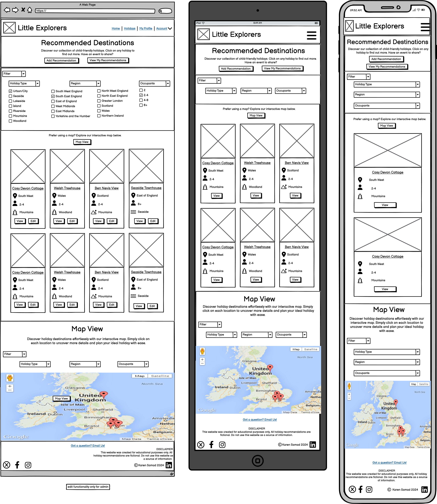

Full Page Reccomendation

 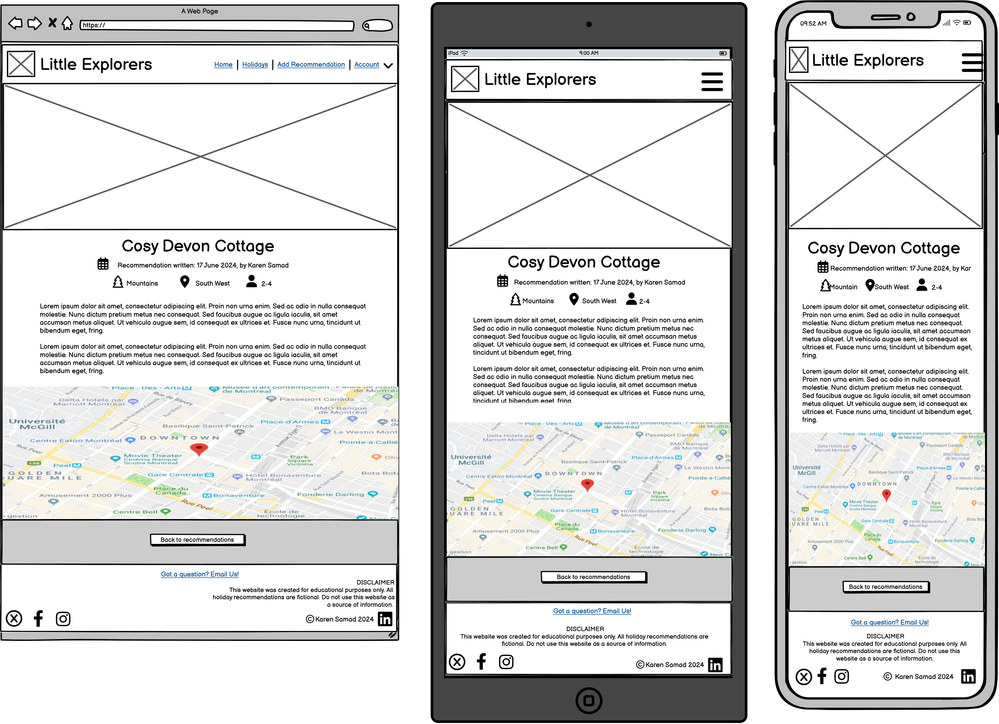

User Profile Page

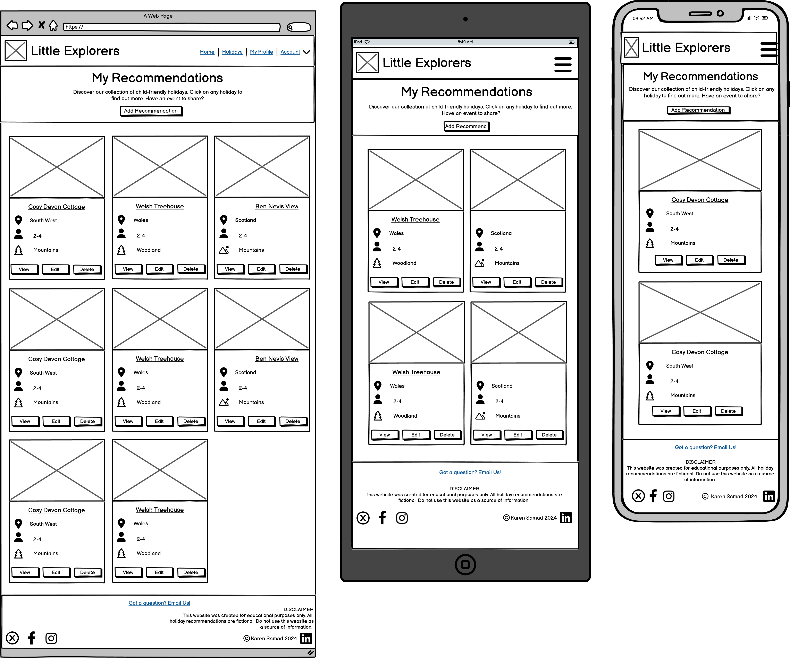

Add Recommendation

 

Edit Recommendation

Admin Profile Page

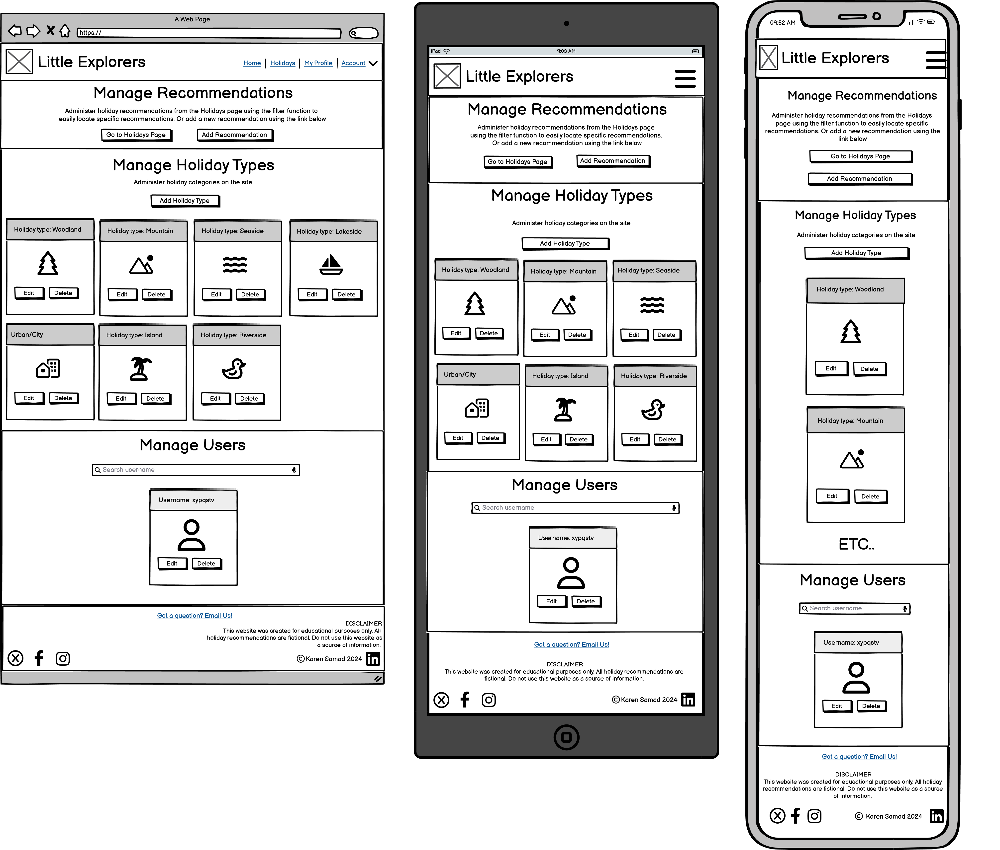

Admin Add Holiday Type

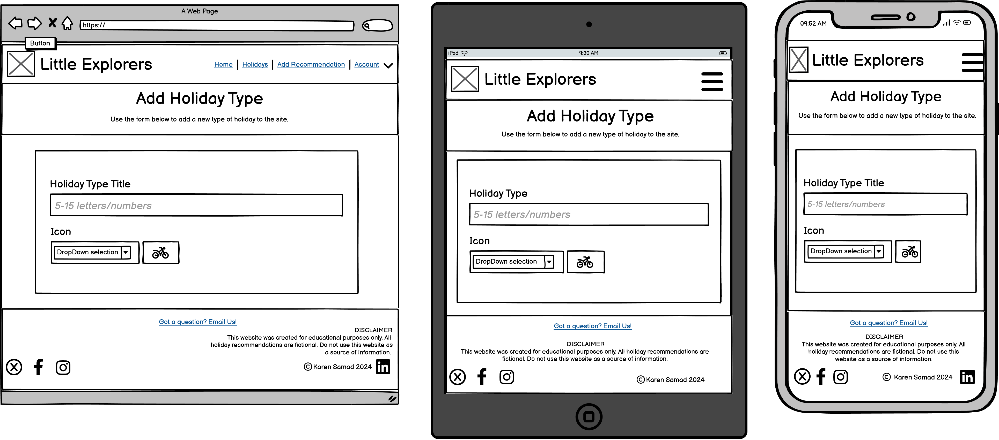

Admin Edit Holiday Type

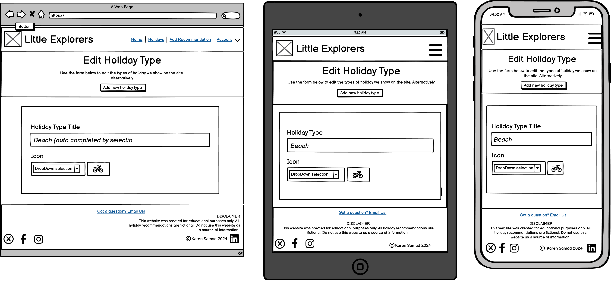

Contact Form

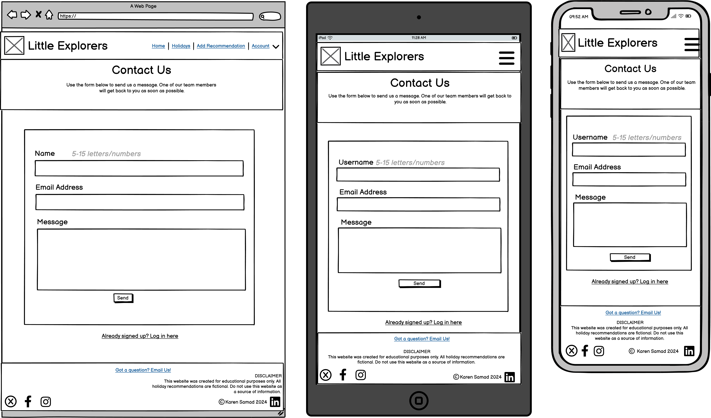

Report Recommendation

Admin Edit User Page

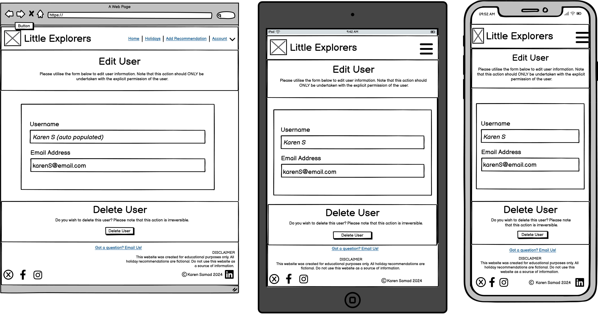

Modal Example

 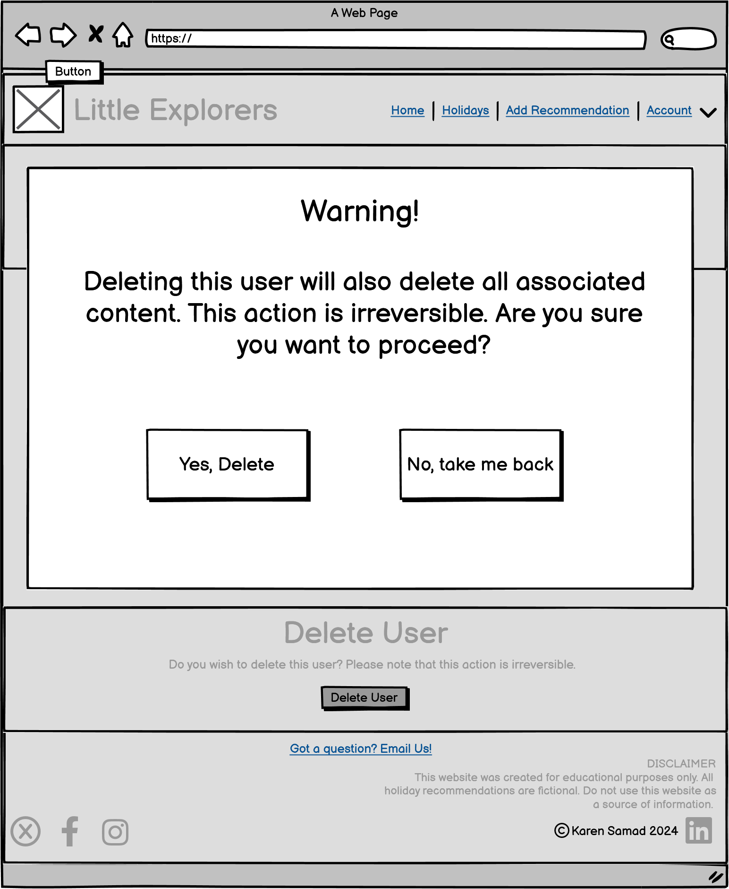

### Surface Design

#### Logo

I utilised Canva to discover an image featuring a compass against a backdrop of mountains, evoking imagery of exploration and direction. I then adjusted the colors and fonts to create a more playful aesthetic, symbolizing the site's association with children's holidays.

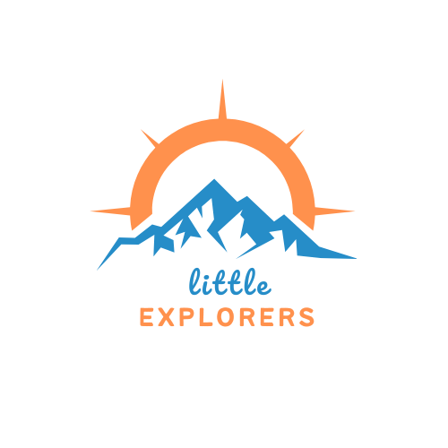

#### Colours

I employed Coolers to select a colour palette that complements the theme of the site, evoking imagery of the outdoors, sun, and play. I ensured the palette includes colours that offer a good contrast for edit and delete buttons, while maintaining harmony with the overall design.

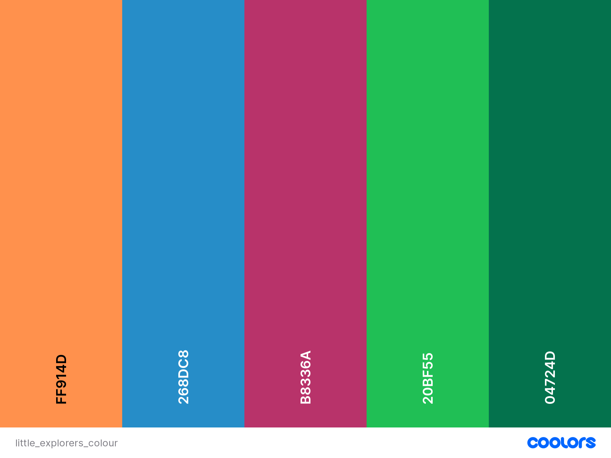

#### Typography

The fonts selected for the website were chosen to match those featured in the logo, ensuring a cohesive design. 
These are: 

* [Pacifico](https://fonts.google.com/specimen/Pacifico)
* [Montserrat](https://fonts.google.com/specimen/Montserrat)

They complement each other well and offer distinct contrast across various sections of the site. For general text, I opted for Lexend due to its exceptional readability, especially for users with additional needs.

* [Lexend](https://fonts.google.com/specimen/Lexend)

#### Imagery

The images featured across the site serve to inform users about the experiences they can expect from recommended holidays and inspire them to embark on such adventures. Each image was chosen to ensure brightness, beauty, and the ability to maintain quality even on large screens.

The Favicon for the site was created from the logo using [favicon](https://favicon.io/). The title text has been removed for clarity. 

#### Features

## ?. Finished site

Base.html

Base.html serves as the foundation for every page, reducing redundancy in code and enhancing efficiency. By consolidating common HTML elements, it accelerates load times, streamlines webpage appearance, and optimizes backend performance.

Contact.html

The emails functionality was created using Email.JS with a template that sends to the admin team the name, email address and message submitted by the user. 

## ?. Technologies

### Languages

HTML, CSS, JavaScript & Python

### Frameworks, Libraries and Programs Used

* [Github](https://github.com/) - to save and store the files for the website.
* [Git](https://git-scm.com/) - for version control, using the Gittpod terminal to commit to Git and Push to GitHub.
* [LucidCharts](https://www.lucidchart.com) - to produce the site flow chart and database design.
* [TableConvert](https://tableconvert.com/csv-to-markdown)- for simplifying the writing of Markdown tables
* [Balsamiq](https://balsamiq.com/) - to create wireframes.
* [Coolers](https://coolors.co/) - to view the colour scheme.
* [Canva](https://www.canva.com/) - to create the logo.
* [Favicon](https://favicon.io/) - to generate the favicons for the page. 
* [Email.JS] (https://www.emailjs.com/) - to send and recieve emails. 

## ?. Testing
## ?. Deployment
## ?. Credits

* The email functionality was adapted from the Code Institute’s tutorial for EmailJS - Putting it all together > Sending Emails Using EmailJS > Sending Emails!

## Gitpod Reminders

To run a frontend (HTML, CSS, Javascript only) application in Gitpod, in the terminal, type:

`python3 -m http.server`

A blue button should appear to click: _Make Public_,

Another blue button should appear to click: _Open Browser_.

To run a backend Python file, type `python3 app.py`, if your Python file is named `app.py` of course.

A blue button should appear to click: _Make Public_,

Another blue button should appear to click: _Open Browser_.

------

