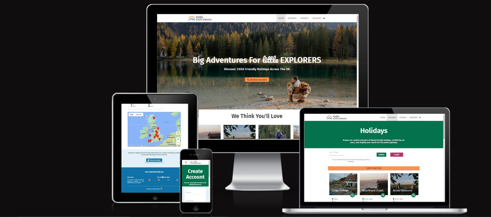
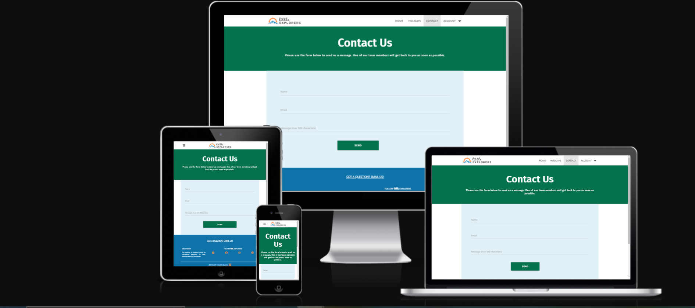

# Little Explorers - A Holiday Recommendation Website by Karen Samad

**** device image *****

Little Explorers is a user-friendly website dedicated to effortlessly browsing and recommending child-friendly holiday destinations. Searching through the recommendations is simplified with an intuitive filter mechanism. Users possess the capability to view, edit, and delete their recommendations effortlessly, while also having the convenience to contact the site's administrators for any inquiries. Furthermore, the site is fortified against malicious content through a "report a post" feature, enabling users to flag inappropriate content, which administrators can promptly review and remove as necessary.

This project is my third Milestone Project as part of the Code Institute's Diploma in Web Application Development. 

---

**** table of contents *****

---

## User Experience Design

Applying UX design principles, I carefully considered the essential features needed by both site owners and users to foster engagement and mutual benefits, resulting in a functional, user-friendly website.

### **Strategy Plane**

#### Site Goals

- To give users the opportunity to find child friendly holidays in the UK.

- To generate revenue from an integrated e-commerce site selling child-related holiday equipment. 

#### User Stories

1. As a user, I want to be able to:

    -  Find what I’m looking for on the site easily and intuitively from the home page and navigation bar. 
    - View the site any device and for the site to be responsive.
    - View and filter holiday recommendations posted by other users.
    - Contact the site owners to suggest a new holiday type, ask questions or report a malicious recommendation.
    - Return to the home page without having to use my browser buttons. including when I navigate to a non-existent page or I’m thrown an error.

2. As a user without an account, I want to be able to:

    - Understand the purpose of the site from the home page
    - Set up an account so I can create my own recommendations.

3. As a user with an account, I want to be able to:

    - Sign into my account.
    - Add my own holiday recommendation using a user-friendly form.
    - View my previously posted holiday recommendations.
    - Edit/Delete recommendations I have posted.    
    - Log out of my account easily. 

4. As an administrator I want to be able to:

    - Sign into my account quickly and easily.
    - Edit any recommendation if necessary (This was not implemented, see [Testing.md](TESTING.md#testing-user-stories]))
    - Add a new holiday type category.
    - Edit a new holiday type category.
    - Delete a user if necessary.
    - Receive email messages from the site users. 
    - Log out of my account easily. 

--- 

### **Scope Plane**

The following opportunity matrix summarises the key features that could be implemented on Little Explorers and the difficulty/viabitliy of each feature. The opportunities will be developed based on their priority scores.

#### **Table 1 Opportunity Summary**

| **Opportunity**                                                                               | **User**       | **Inportance** | **Viability** | **Score** |
|-----------------------------------------------------------------------------------------------|----------------|----------------|---------------|-----------|
| All pages - Navbar                                                                            | All            | 5              | 5             | 10        |
| All pages - Footer containing social links, contact, copyright and disclaimer                 | All            | 5              | 5             | 10        |
| Homepage - brand and explanatory text                                                         | All            | 5              | 5             | 10        |
| Homepage - Showcase of some recommendations                                                   | All            | 5              | 5             | 10        |
| Recommended holiday main page - Showcase of recommendations + Map showing holiday desinations | All            | 5              | 3             | 8         |
| Recommended holiday main page - Map with clickable links                                      | All            | 5              | 2             | 7         |
| Filter function to find tailored recommendations                                              | All            | 5              | 3             | 8         |
| Contact Page                                                                                  | All            | 5              | 5             | 10        |
| Sign In Functionality                                                                         | All            | 5              | 5             | 10        |
| Create Account Functionality                                                                  | All            | 5              | 5             | 10        |
| Sign Out Functionality                                                                        | Signed In User | 5              | 5             | 10        |
| Passowrd reset Functionalitliy                                                                | Signed In User | 3              | 1             | 4         |
| Profile Page with user's own recommendations + edit/delete options                            | Signed In User | 5              | 5             | 10        |
| User add Recommendation Page                                                                  | Signed In User | 5              | 5             | 10        |
| User edit Recommendation Page                                                                 | Signed In User | 5              | 5             | 10        |
| Holiday Recommendation Full Page information with map                                         | Signed In User | 5              | 4             | 9         |
| Ability to Report a Recommendation                                                            | Signed In User | 4              | 4             | 9         |
| Ability to rent child-related holiday equipment from the site                                 | Signed In User | 2              | 2             | 4         |
| Admin profile page with options to add/edit recommendations and holiday types                 | Admin Only     | 5              | 5             | 10        |
| Manage Holiday Type Page (with edit/delete links)                                             | Admin Only     | 5              | 5             | 10        |
| Add Holiday Type Page                                                                         | Admin Only     | 5              | 5             | 10        |
| Edit Holiday Type Page (with delete button)                                                   | Admin Only     | 5              | 5             | 10        |
| User search function                                                                          | Admin Only     | 4              | 3             | 7         |
| Delete user functionalitly                                                                    | Admin Only     | 4              | 4             | 8         |
| Custom Error Pages                                                                            | All            | 5              | 3             | 8         |

### Stucture Plane

Based on the [User Stories](README.md#user-stories) and the opportunities outlined in [Table 1](README.md#table-1-opportunity-summary) the following structure was planned for the site. 

This site map outlines the design of the website and which pages are accesible to which user. 

This table outlines the design for the PostgreSQL database used to store the data, a relational database.

During development, the database was modified as the admin features I wanted from a separate table could be achieved using a Boolean "is_admin" attribute in the USER table. Furthermore, I altered the way I accessed image content, using the saved URL rather than image name and ensured the image mimetype was analysed for defensive programming. 

I will also Flask, a templating language to dynamically generate HTML content within my application. Flask's templating engine allows me to embed Python code directly into HTML templates, enabling me to build dynamic and interactive web pages that combine static HTML with dynamic content generated by my Python backend. As a result my css and js will be within a static folder. 

I'll also use SQLAlchemy, an ORM (Object-Relational Mapping) tool integrated with Flask, to interact with the database. SQLAlchemy simplifies database operations by providing a Pythonic interface, allowing me to define models using Python classes and perform CRUD operations within my Flask application.

### Skeleton Plane

#### Wireframes

The following wireframes were created to outline the content for each page and demonstrate its responsive behavior across different devices.

I've opted to expand the display of the mobile and tablet designs to ensure thorough planning of content placement, accounting for the constraints of these devices.

All pages will consist of a logo and navigation bar, enabling users to navigate to different sections of the site. The logo or title will serve as a link back to the homepage.

Additionally, each page will feature a footer providing links to social media platforms, a site disclaimer, and a contact link for reaching the site administrators.

The content on each page is customised to its specific purpose but maintains a consistent design language across all pages, ensuring seamless flow and enhancing the user experience. Further details about the features on each page are outlined in the ????????[finished site]()section below. 

Home Page

Create Account

 

Sign In

 

Recommendations Gallery

Full Page Reccomendation

 

User Profile Page

Add Recommendation

 

Edit Recommendation

Admin Profile Page

Admin Add Holiday Type

Admin Edit Holiday Type

Contact Form

Admin Edit User Page

Modal Example

 

### Surface Design

#### Logo

I utilised Canva to discover an image featuring a compass against a backdrop of mountains, evoking imagery of exploration and direction. I then adjusted the colors and fonts to create a more playful aesthetic, symbolizing the site's association with children's holidays.

#### Colours

I employed Coolers to select a colour palette that complements the theme of the site, evoking imagery of the outdoors, sun, and play. I ensured the palette includes colours that offer a good contrast for edit and delete buttons, while maintaining harmony with the overall design.

#### Typography

The website's font was chosen to match the logo, ensuring a cohesive design. The fonts are easy to read, enhancing overall readability and user experience.

* [Pacifico](https://fonts.google.com/specimen/Pacifico)
* [Fira Sans](https://fonts.google.com/specimen/Fira+Sans)

They complement each other well and offer distinct contrast across various sections of the site. 

#### Imagery

The images featured across the site serve to inform users about the experiences they can expect from recommended holidays and inspire them to embark on such adventures. Each image was chosen to ensure brightness, beauty, and the ability to maintain quality even on large screens.

The Favicon for the site was created from the logo using [favicon](https://favicon.io/). The title text has been removed for clarity. 

#### Features

## Finished site

Updates from Design:

* The blue background colour was updated to #0f72a8 to provde more contrast and comply with accesibility requiremnts. 

* A specific reporting interface was not implemented at this time. I felt that the contact process was sufficiently easy, allowing users to report inappropriate posts without needing a separate form.

* The word "recommendations" was changed to "holidays" when referring to the holiday recommendations posted by users. I felt this was more informative about the site's purpose, and the shorter word improved the page design.

All page information:

All forms across our site utilize Materialize form inputs, ensuring a consistent and visually appealing user interface. These inputs come with added functionality, including dynamic feedback that visually signals correct (green) or incorrect (red) completion of fields, thereby improving user understanding and interaction.

Additionally, our forms feature built-in validation prompts that guide users to input valid email addresses (containing '@') when required, promoting data accuracy and submission reliability.

Furthermore, for elements lacking built-in Materialize checks, custom programming has been implemented to enhance the user experience. These checks ensure all form elements are completed before submission. In instances where input is missing, clear messages prompt users to fill in the required fields or make necessary modifications, facilitating form completion.

### All Users

Base.html

Base.html serves as the foundation for every page, reducing redundancy in code and enhancing efficiency. By consolidating common HTML elements, it accelerates load times, streamlines webpage appearance, and optimises backend performance. The base page loads the Nav Bar and the Footer for every page. 

The navigation bar enhances user experience by highlighting the current page and providing seamless navigation throughout the site. The logo and site title serve as a convenient link back to the home page. 

For logged-out users, the navigation menu includes options for 'Home,' 'Holidays,' 'Contact,' and an 'Account' dropdown, offering choices for 'Sign In' and 'Create Account.' Upon logging in, users gain access to additional features such as 'Add Holiday,' and the 'Account' dropdown transforms into 'Profile' and 'Sign Out'. 

Administrators enjoy an exclusive 'Manage' tab, replacing 'Add Holiday,' granting them access to functionalities like managing holiday types, users, adding holidays, and creating new administrator accounts

On small devices the navigation bar shrinks to a burger dropdown menu.

The footer contains a link to the contact form asking users "Got a Question?". It also highlights the social media pages for Little Explorers and credits the designer of the site. Additionally, there is a disclaimer stating that this is an educational site and that the reviews are not real.

Home Page (index.html)

Users are greeted with a crisp hero image that promotes the sense of adventure, family, and holidays the site aims to portray. It features the slogan "Big Adventures For Little Explorers" and the subtitle "Discover child-friendly holidays across the UK," immediately providing users with the information they need to understand the site's purpose.

The site offers a direct link for users to begin browsing holidays immediately. However, for users who may be uncertain about using the platform, strategically curated suggestions by site admins are prominently displayed. These suggestions are designed to inspire users and provide a glimpse of the diverse content available on the site. Additionally, users are presented with a convenient "See More Holidays" button, ensuring easy access to further exploration without the need to backtrack or search extensively. This button is present in the same viewing plane as a quote which highlights how fantastic another user has found little Explorers. This approach aims to enhance user experience by guiding users seamlessly through the site and facilitating effortless navigation to desired content.

At the conclusion of the page, users are encouraged to join the site and contribute their holiday recommendations. They are presented with options to either create an account or sign in if they already have one. Upon logging in, the content dynamically updates to prompt users to "Share A Gem" and submit a recommendation to the site. Additionally, users can access their profile by following the provided link to review their previously added recommendations. 

Holidays Page (recommendations.html)

The main holidays page presents users with a comprehensive collection of all holidays listed on the site, each displayed as an informative card featuring essential details such as the title, region, occupancy, and holiday type. Leveraging Jinja templating and database data, this information is seamlessly auto-populated. Each card allows a user to navigate to the full page review using either the magnifying glass icon or clicking the main image. 

Users enjoy the flexibility of searching (case insensitive) through posts using keywords found within the reviews or holiday types. This dynamically updates the page to display only relevant holidays matching the search criteria. In cases where no search results are found, users are promptly notified with a flash message.

Additionally, users can opt for a map view of the holidays if preferred. A prominent button facilitates easy navigation to this section. During a search, the map pins are dynamically updated to exclusively display the searched holidays, ensuring a synchronised experience between search results and map visualisation.

Full Page Holiday (view_recommendation.html)

The full-page holiday review showcases all the information submitted by the user when they wrote about the holiday. It prominently displays the user-chosen image along with the holiday's title, date of visit, author's name, holiday type, region, and the number of occupants. Following this, the complete review is presented, providing comprehensive insights into the holiday experience.

At the bottom of the page, a map displays a single pin indicating the holiday's location. Additionally, a convenient button allows users to easily navigate back to the main holidays page without relying on their browser's back button.

Contact Form

The contact form provides users with a straightforward way to reach out to the site administrators. Upon sending the email, users receive a confirmation message indicating that their email has been successfully sent.

The email functionality was implemented using Email.JS, incorporating a template that automatically sends the user's name, email address, and message to the admin team.

### Under the Account Dropdown

#### Signed Out Users:

Create Account (create_account.html)

Users can utilise the form to register an account and unlock additional features of the site. They are prompted to select a unique username and enter their email address, both of which must be unique. They are then asked for a password and to repeat the password. When both passwords match, the submit button becomes active so the user can submit the form.

The password stored in the database undergoes hashing using Wexueg's robust security method to generate a password hash.

If their email address has already been used to create an account, they are prompted and automatically taken to the sign-in page. 

Sign In (sign_in.html)

Upon accessing the login page, users are prompted to input their email address and password. If either of these credentials are incorrect, users are promptly presented with a generic error message indicating that either their email or password is incorrect. This intentionally ambiguous wording is employed as a security measure to deter potential hacking attempts.

The submission of the form, initiated by clicking the submit button located at the bottom, adds the user to the session and therefore allows them to access signed-in user only content. Upon successful sign-in, users are automatically redirected to their profile page.

Additionally, a link to the create account form is provided in case users navigate to the login page erroneously.

#### Signed In Users:

User Profile Page (profile.html)

The profile page warmly welcomes the user with a personalised greeting in the heading banner, such as 'Hello, Karen' (or whichever user is logged in), injecting personality and familiarity into the site to enhance user engagement.

Within this personalised space, users can explore all the recommendations they've contributed to the site, creating a tailored experience focused on their individual contributions. Utilising Jinja templating and Materialize cards, the page dynamically presents content based on the user's session and unique user ID, ensuring precise display of their contributions. As with the Holidays page the image and magnifying glass on each card act as links to the full page review. 

Furthermore, a prominently displayed button encourages users to continue sharing their experiences by adding another holiday to the site, streamlining the content creation process.

Moreover, users retain control over their previous posts, with options to edit or delete them directly from their profile page. Opting to edit redirects users to the edit holiday page. 

Should users choose to delete a post, they encounter a protective modal, designed to prevent accidental deletions. This modal employs defensive programming techniques, requiring users to confirm their decision, thereby mitigating the risk of unintended deletions." 

 

Sign Out

When users click 'Sign Out,' they are immediately logged out of their session. They are then redirected to the home screen, where they can only access base user content. A flash message confirms the successful completion of this action, ensuring users are informed of their logout status.

### Signed In User Content

Add Holiday (add_recommendation.html)

The 'Add Holiday' page empowers logged-in users to contribute by recommending new family-friendly holiday destinations to the site. Users are prompted to provide a concise holiday title (up to 30 characters) and select the holiday type from a dropdown menu, populated with options curated by admin users and stored in the database.

Next, users specify the holiday's region and the number of occupants via dropdown menus. Additionally, they select the date when they undertook the holiday, completing the submission process.

In the following section, users are prompted to specify the location of the holiday. They have the option to input the full address manually into the provided text box or begin typing and select from a dropdown menu populated by the Google API. Alternatively, users can interactively move the map pin to their desired location on the map interface. This automatically updates the address field to be saved in the database. 

Subsequently, users are presented with a text box where they can input their review. A word limit of 1000 characters is enforced, with a helpful countdown indicating the remaining characters available to the user.

The final section of the form requests users to upload an image. Users can select their file, ensuring it is in image format. Protective programming notifies the user if they have selected an incorrect file format. Before submitting the form, users have the option to preview the selected image. This image interface leverages the Cloudinary API, where only the image URL is saved to the database, with the main image being stored on the Cloudinary server.

Once a user feels they have completed the form, they can use the submit button to send the data. If any elements of the form are missing, the user is promptly notified. Once submitted, they are redirected to their profile page where the review will be displayed.

Edit Holiday  (edit recommendation.html) 

From a user's profile page, they can access the edit holiday page, enabling them to amend any holiday recommendation they have previously posted on the site. The form auto-populates the data already submitted, mirroring the information outlined in the add holiday section. Users have the freedom to edit any section as desired and then simply click 'Save' at the bottom. This action updates the holiday in the database and on the site.

### Admin Only Content

Admin Profile Page

The Profile page for an admin user functions similarly to that of a non-admin user, with additional features tailored to aid admins in using the site effectively. In addition to standard user profile functionality, admin users have access to exclusive admin-only content.

This includes a button that allows them to navigate to the admin-only section. Within this section, admins are presented with three buttons:

1. 'Users': This button directs admins to the user management page, where they can manage user accounts.

2. 'Holiday Type': This button navigates admins to a page dedicated to managing holiday type categories for each recommendation.

3. 'Main Holidays': Admins are provided with a link to the main holidays page, equipped with search functionality. This enables admins to efficiently delete any recommendation as needed.

Holidays page (Admin)

In addition to the functionality outlined above, admins possess the authority to delete any recommendation from the holidays site, irrespective of the author. This capability empowers admins to maintain oversight of the site's content and promptly remove any malicious or inappropriate submissions.

It's worth noting that admins do not have the ability to edit posts. This intentional design choice aligns with the site's ethos, ensuring that recommendations remain authentic and are authored solely by the respective user.

Add Holiday Type

Edit Holiday Type

Users Page

Create Account (Admin)

To facilitate seamless scalability, administrators have the capability to add other administrators to the site. This form is distinct from the one accessible to general users, featuring an additional checkbox option that enables the user to be designated as an administrator. This grants them access to all administrative features. 

### Home.html
### Recommendations.html (Holidays Page)
### Contact.html

### Under the Account dropdown

### Profile.html
### Home.html
### Home.html
### Home.html
### Home.html
### Home.html

### Contact.html

The emails functionality was created using Email.JS with a template that sends to the admin team the name, email address and message submitted by the user. 

## Technologies

### Languages

HTML, CSS, JavaScript & Python

### Frameworks, Libraries and Programs Used

* [Github](https://github.com/) - to save and store the files for the website.
* [Git](https://git-scm.com/) - for version control, using the Gittpod terminal to commit to Git and Push to GitHub.
* [LucidCharts](https://www.lucidchart.com) - to produce the site flow chart and database design.
* [TableConvert](https://tableconvert.com/csv-to-markdown)- for simplifying the writing of Markdown tables
* [Balsamiq](https://balsamiq.com/) - to create wireframes.
* [Coolers](https://coolors.co/) - to view the colour scheme.
* [Canva](https://www.canva.com/) - to create the logo.
* [Favicon](https://favicon.io/) - to generate the favicons for the page. 
* [Email.JS] (https://www.emailjs.com/) - to send and recieve emails. 
* [Google Maps JS API](https://developers.google.com/maps/documentation/javascript/overview) - to create and update features on the maps. 

## ?. Testing
## ?. Deployment
## ?. Credits

* The email functionality was adapted from the Code Institute’s tutorial for EmailJS - Putting it all together > Sending Emails Using EmailJS > Sending Emails!

* The map on the add recommendation page was adapted from the YouTube tutorial by [Imran Sayed](https://www.youtube.com/watch?v=yhhkNtdg5x0&list=PLD8nQCAhR3tT9dU8JKLpG3av-WMQGPPFP&index=1)

## Gitpod Reminders

To run a frontend (HTML, CSS, Javascript only) application in Gitpod, in the terminal, type:

`python3 -m http.server`

A blue button should appear to click: _Make Public_,

Another blue button should appear to click: _Open Browser_.

To run a backend Python file, type `python3 app.py`, if your Python file is named `app.py` of course.

A blue button should appear to click: _Make Public_,

Another blue button should appear to click: _Open Browser_.

------

