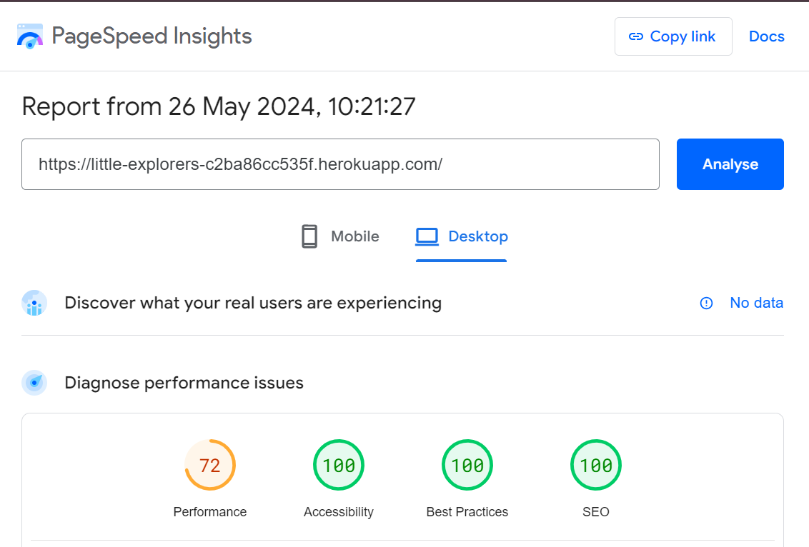
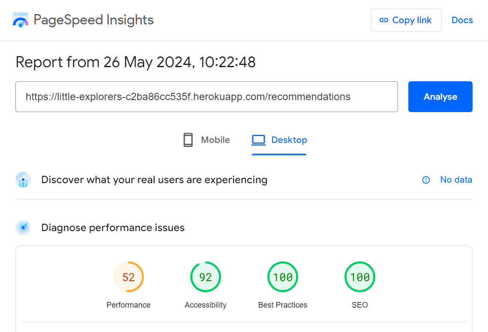
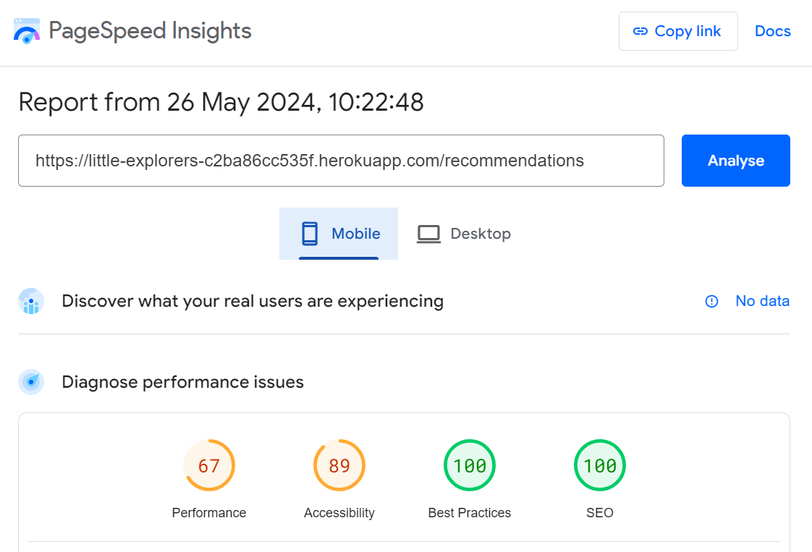
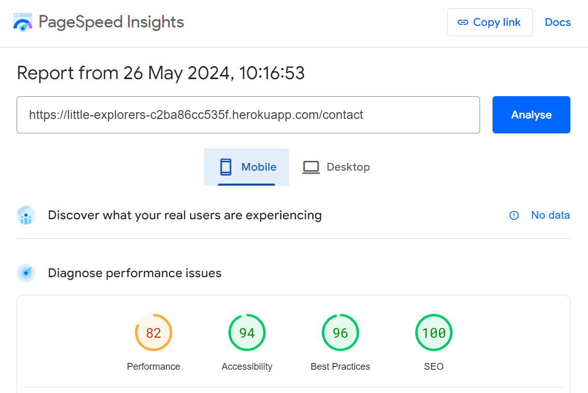
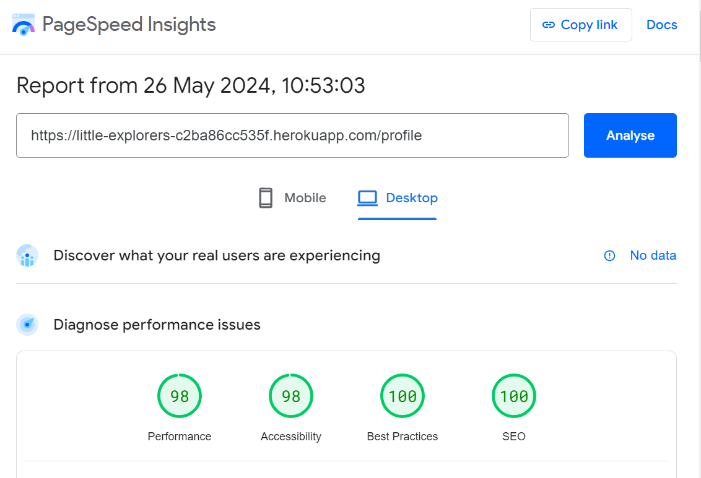

<h1 align="center">Little Explorers-Testing</h1>

[View the live website here - Little Explorers](https://little-explorers-c2ba86cc535f.herokuapp.com/)

---

<h2>Contents</h2>

- [Introduction](#introduction)
- [Automated Testing](#automated-testing)
  * [HTML Validation](#html-validation)
  * [CSS Validation](#css-validation)
  * [Javascript Validation](#javascript-validation)
  * [Python Validation](#python-validation)
  * [Performance (Lighthouse)](#performance--lighthouse-)
  * [Accessibility](#accessibility)
- [Manual Testing](#manual-testing)
  * [Testing User Stories](#testing-user-stories)
  * [Real User Testing](#real-user-testing)
  * [Testing Code Functions](#testing-code-functions)
  * [Mobile and Desktop Test Results](#mobile-and-desktop-test-results)
      - [All Users](#all-users)
      - [Logged In Users Only](#logged-in-users-only)
      - [Admin Only Features](#admin-only-features)
- [Bugs and Fixes](#bugs-and-fixes)

<small><i><a href='http://ecotrust-canada.github.io/markdown-toc/'>Table of contents generated with markdown-toc</a></i></small>

# Introduction

Testing is essential to ensure that the website functions properly, free from bugs, and that users can fully utilise its features before its release to the general market. This guarantees a positive user experience (UX) and encourages repeat visits from players.

Throughout the game development process, I relied on Chrome developer tools to assess page responsiveness across various screen sizes and address any encountered issues.

In troubleshooting, I utilised the console to log and monitor JavaScript code, aiding in resolving aspects of the game that did not perform as intended. All the test results detailed below are based on the [deployed site](https://little-explorers-c2ba86cc535f.herokuapp.com/).

____

# Automated Testing

## HTML Validation

[W3C](https://validator.w3.org/) was used to validate the HTML.

Minor code structure errors were addressed (such a extra closing div's) and invalid form describers were removed (e.g duplicate required elements, or required on elements hidden from the user).

Please note that the error messages which relate to a "Trailing slash on void elements" have been filtered as they are automatically added by the browser and are not a true error (as advised by the CI tutors).

As all validated screens look the same I am just displaying one here with the individual valid test results documented in the table below. 

HTML Validation Results Table

| **Page (html)**      | **Result**                            |
|----------------------|---------------------------------------|
| Add Holiday Types    | Passed- No errors or warnings to show |
| Add Recommendation   | Passed- No errors or warnings to show |
| Base                 | Passed- No errors or warnings to show |
| Contact              | Passed- No errors or warnings to show |
| Create Account       | Passed- No errors or warnings to show |
| Edit Holiday Types   | Passed- No errors or warnings to show |
| Edit Recommendation  | Passed- No errors or warnings to show |
| Holiday Types        | Passed- No errors or warnings to show |
| Index (Home)         | Passed- No errors or warnings to show |
| Profile              | Passed- No errors or warnings to show |
| Recommendations      | Passed- No errors or warnings to show |
| Sign In              | Passed- No errors or warnings to show |
| Users                | Passed- No errors or warnings to show |
| View Recommendations | Passed- No errors or warnings to show |
| 404 Error            | Passed- No errors or warnings to show |

____

## CSS Validation
CSS was validated using [W3C Jigsaw](https://jigsaw.w3.org/css-validator/).

CSS Validation Screenshot

____

## Javascript Validation

The JavaScript code was validated using [JSHint](https://jshint.com/). 

Please note, warnings relate the use of ES6/8 and are acceptable for the parameters of this project.

addRecommendation JS

1. Documented an "unsued" function CheckMaxLength. This is triggered from the HTML form.

createAccount JS

1. Documented an "unsued" function checkPasswordMatch. This is triggered from the HTML form.

maps-search JS

1. Documented undefined/unused variables - all are called elsewhere by Google Maps API.

maps-view JS

1. Documented undefined/unused variables - all are called elsewhere by Google Maps API.

maps JS

1. Documented undefined/unused variables - all are called elsewhere by Google Maps API.
2. Warnings relating to missing semi colons. All fixed. 
3. One variable unused (address) so removed. 

script JS

1. Documented undefined/unused variables - all are called elsewhere by Materialize elements.
2. Warnings relating to missing semi colons. All fixed.  

sendEmail JS

1. Documented undefined/unused variables - all are called elsewhere by emailJS in the contact form. 

___

## Python Validation

Python pep8 validation was done via [Code Institute's Python Linter](https://pep8ci.herokuapp.com/).

__init__ Python

1. Resolved issues included correcting gaps and whitespace. The import of routes has been left at the bottom of the file. Although this doesn't comply with PEP8, it is necessary to prevent a circular import.

Models Python

1. Resolved issues included correcting gaps/whitespace and retructuring to reduce line length. 

Routes Python

1. Resolved issues included correcting gaps/whitespace and retructuring to reduce line length.

___

## Performance (Lighthouse)

The site was run through the Google Chrome Developer tool Lighthouse to assess it's performance. The scores for each page are listed below. 

Home (index.html)

Holidays (recommendations.html)

Accesibiltiy issue comes from the Materialze set styles and that links do not have a discernible name. However I have already addressd this and set screen reader only classes which describe each link using the recommendation name.

Contact

Add Holiday

Accesibiltiy issue comes from the Materialze set styles on form. 

Holiday Types

Add Holiday Type

Users

Create Account

Profile

Sign In

___

## Accessibility

The site underwent an accessibility check using [Silktide's Accessibility Checker.](https://silktide.com/toolbar/)

Several changes were implemented to enhance accessibility:

1. Contrast improvements were applied to the footer and similarly colored buttons to enhance readability.

2. The exclamation mark ("!") was removed from links that do not lead to new pages, ensuring consistency and clarity.

3. Specific descriptions were added as screen reader-only content to aid users in navigating to specific pages and ensuring they are deleting the correct content.

4. Contrast on orange buttons was adjusted to display black text instead of white, improving visibility.

5. Autocomplete options were added to various elements. 

While most contrast issues were addressed, some persist with elements inherited from Materialize form input components.
____

# Manual Testing

## Testing User Stories

The site was built from the User Stories documented in the [Readme](README.md#user-stories). The site was tested against each of them and the results are documented below.

As a user, I want to be able to:

- Find what I’m looking for on the site easily and intuitively from the home page and navigation bar.

    - The navigation bar is displayed on all pages with relevant links for each type of user. All links direct users to the correct pages. The home page guides users to the holidays page multiple times and encourages them to join the community at the bottom. If the user is logged in, this message changes to prompt them to add a new holiday.

- View the site any device and for the site to be responsive.

    - The site is responsive across a diverse range of devices. The navigation bar and page layout adjust according to the screen size. Modals are also fully responsive and function correctly on all tested devices.

- View and filter holiday recommendations posted by other users.

    - Holidays can be searched by keyword, either by holiday type (allowing users to narrow down their options to the type of holiday they want to take) or by keyword from the holiday reviews. This enables users to conduct more detailed searches, such as "zoo" or "age 3."

- Contact the site owners to suggest a new holiday type, ask questions or report a malicious recommendation.

    - There are multiple ways for a user to navigate to the contact form. There is a link in the footer on every page, and the page can also be accessed from the main navigation menu. Detailed information on each recommendation allows users to notify admin staff of problematic posts, enabling targeted actions against specific content or users. After submitting the form, the user is notified that their message has been sent. 

- Return to the home page without having to use my browser buttons. including when I navigate to a non-existent page or I’m thrown an error.

    - The Home page can be accessed at any time using the logo in the navigation bar or from the home option in the navigation menu. On error pages, a button is provided for users to "Return to the Home Page."

As a user without an account, I want to be able to:

- Understand the purpose of the site from the home page.

    - The Home page features clear imagery that identifies it as a holiday site focused on children. The opening title and slogan, "Big adventures for little explorers," explain the purpose of the site, with a subtitle stating "Discover child-friendly holidays across the UK." Recommended holidays are displayed directly underneath the header to entice users and showcase what the site is about. Further down, users are prompted to join the site, informing them that this is a community site with holidays recommended by fellow users.

- Set up an account so I can create my own recommendations.

    - There are several promts for a user to create and account. Firstly, from the home page but also from the nav bar (present on every page).

As a user with an account, I want to be able to:

- Sign into my account.

    - Users can sign in to their account from the link in the navigation menu. There are also prompts on the create account page if the user tries to create an account with an email already registered on the site. Additionally, wherever users are informed that they can create an account, there is also an option to sign in if they "already have an account."

- Add my own holiday recommendation using a user-friendly form.

    - The Add Holiday/Recommendations page can be easily accessed from various places on the site, including the navigation bar, the main recommendations page, the user's profile, and the bottom of the home screen (for logged-in users only). On the Add Recommendation page, users have access to an easy and clear form that enhances the user experience (UX). Each field prompts the user with what they need to write and notifies them if any section is blank before submission can occur.

- View my previously posted holiday recommendations.

    - The user can see thier posted holidays from their profile page, which only renders holidays added by that logged in user.  

- Edit/Delete recommendations I have posted.

    - A user can edit their posts by clicking the "edit" button on the specific holiday they wish to edit on the recommendations page. The delete button prompts a modal which asks the user if they are sure. This ensures the user is absolutely sure they wish to delete a post from the database. Posts cannot be edited/deleted by other users. 

- Log out of my account easily. 

    - A user can easily log out of their account using the "Sign Out" button in the nav bar.  

As an administrator I want to be able to:

- Sign into my account quickly and easily.

    - Admins log in via the same navigation link as all users in the navigation bar.

- Edit any recommendation if necessary.

    - Admin users cannot edit a user's post. After working on the site, I realized that allowing admins to edit user posts might undermine user confidence, as they wouldn't know if a review was genuine or if it had been altered by an admin. Users have the ability to edit their own posts and can contact admins for assistance if needed. Admins retain the ability to delete posts to ensure that malicious or inappropriate content can be addressed promptly.

- Add a new holiday type category.

    - A new holiday type can be added from the Holiday Type page using the Add button. The form is easy and simple to use making it easy for admin staff to add new catagories. 

- Edit a new holiday type category.

    - A existing holiday type can be edited easily using the "Edit" button on each Holiday type. 

- Delete a user if necessary.

    - The Users page, accessible only to admin staff, provides an overview of all registered users on the site. Admins can search for users by email address or username, granting them the ability to identify and address any instances of inappropriate content posted by users. This functionality ensures the maintenance of a safe and appropriate environment on the site.

- Receive email messages from the site users. 

    - The contact form is seamlessly integrated with the little.explorers@gmail.com account. When messages are submitted, they are automatically sent and the content is formatted for easy readability. Each email includes the sender's name, email address, and the message content, ensuring efficient communication and follow-up.
    
- Log out of my account easily. 

    - Like all users of the site. It is easy to log out using the "Sign out" Link in the navigation bar. 

____

## Real User Testing

Little Explorers was reviewed by friends and family. They were encouraged to comment on their user experience and feedback on any bugs they found. In each testing environment, users were asked to pay particular attention to the buttons and the overall look of the page.

Comments from User 1 (iphone 13 ):

1:

- Comment: "It is difficult to know how much of the review space you have left when you're typing, a countdown on character's left would be helpful"

- Action Taken: A character countdown paragraph was added to notify the users of their remaining entitlemnt. this was imnpletments using javascript. 

2:

- Comment: "When tyring to select a holiday type when adding a recommended holiday, the drop down menu doesn't always register what they pressed."  

- Action Taken: After researching this issue, I found that it is a common and well-documented problem with Materialize select boxes. [This post](https://github.com/Dogfalo/materialize/issues/6464) identified a patch that I could implement to resolve the issue. Further testing by the user confirmed that this solution was successful.

3:

- Comment: "I couldn't find an option that I wanted as my holiday didn't fit under any of your catagories"

- Action Taken: I have added an "Other" catagory to pick these up. an admin could group them accordignly as the site grew it's database. 

4:

- Comment: "It would be better if the image on the holidays page, also took you to the main reveiw page, rather than just the magnifying glass."

- Action Taken: I have added code so that the image is also a clickable link.  

5:

- Comment: "Is it possible to add a part which allows you to know the ages of the children, so I could filter by holidays suitable for a 3yr old for example"

- Action Taken: This comment has picked up a feature that would be very valuble to this website. However, to implement it would reqire signficant restructuring of the database, the displayed information and the search functionality. Therefore at this time, I have not made changes to respond to this comment but they should be addressed for future roll outs.  

6:

- Comment: "It could be nice to let the user add a link to the air b and b/place they stayed or to link to places they visited"

- Action Taken: As above.  

Comments from User 2 (Pixel 7):

- Comment: "When my search result doesn't have any hits, I get all results returned rather than none. Might be nice to have a message that notifies the user this has happened."

- Action Taken: This user is visually impaired and might not have noticed the flash message that appears when a search yields no results. Therefore, I modified the route to achieve two improvements. Firstly, if the search returns no results, no cards are displayed, providing a clear indication of the absence of results. Additionally, I replaced the flash message with an alert div, which explicitly informs the user that no search results were found.

Other flash messages have been designed to be more intuitive and guide the user to a page where they can infer what has happened. Therefore, I have left them unchanged.
____

## Testing Code Functions

The desktop version of the site underwent testing across various browsers and devices to ensure compatibility. Testing included Google Chrome, Mozilla Firefox, and Microsoft Edge on desktop computers. Additionally, Chrome was tested on both Lenovo Tablet and Pixel devices, while Safari was used for mobile testing.

The site was responsive on all browsers and devices (down to  320px as recommended by [Free Code Camp](https://www.freecodecamp.org/news/media-query-css-example-max-and-min-screen-width-for-mobile-responsive-design/))

____

## Mobile and Desktop Test Results

#### All Users

Nav Bar (base.html)

| ****Feature****              | ****Expected Outcome****                     | ****Test Performed**** | ****Result****                                   | ****Pass/Fail**** |
|------------------------------|----------------------------------------------|------------------------|--------------------------------------------------|-------------------|
| All Users                    |                                              |                        |                                                  |                   |
| Little Explorer Logo         | Redirect to Home page when clicked           | Clicked Logo/Title     | Redirects to Home Page                           | Pass              |
| Home Page Link               | Redirect to Home page when clicked           | Clicked Link           | Redirects to Home Page                           | Pass              |
| Holidays Page Link           | Redirect to Holidays page when clicked       | Clicked Link           | Redirects to Holidays Page                       | Pass              |
| Contact Page Link            | Redirect to Contact page when clicked        | Clicked Link           | Redirects to Contact Page                        | Pass              |
| Account Dropdown             | Reveals Links to all users                   | Clicked Account Title  | DropDown menu shown                              | Pass              |
| Create Account Link          | Redirect to Create Account page when clicked | Clicked Link           | Redirects to Create Account Page                 | Pass              |
| Sign In Link                 | Redirect to Sign In Page when clicked        | Clicked Sign In        | Redirected to Sign in Page                       | Pass              |
| Logged In User (not Admin)   |                                              |                        |                                                  |                   |
| Add Holiday Link             | Redirect to Add Holiday page when clicked    | Clicked Link           | Redirects to Add Holiday Page                    | Pass              |
| Account Dropdown             | Reveals Links to all users                   | Clicked Account Title  | DropDown menu shown                              | Pass              |
| Profile Link                 | Redirect to Profile Page when clicked        | Clicked Link           | Redirects to Profile Page                        | Pass              |
| Sign Out Link                | Signs the User out                           | Clicked Sign Out       | Logged out of the system (notified with message) | Pass              |
| Admin only                   |                                              |                        |                                                  |                   |
| Manage (admin only) Dropdown | Reveals links for admin                      | Clicked Manage Title   | DropDown menu shown                              | Pass              |
| Holiday Types Link           | Redirect to Holiday Types page when clicked  | Clicked Link           | Redirects to Holiday Types Page                  | Pass              |
| Users Link                   | Redirect to Users page when clicked          | Clicked Link           | Redirects to Users Page                          | Pass              |
| Add Holiday page             | Redirect to Add Holiday page when clicked    | Clicked Link           | Redirects to Add Holiday Page                    | Pass              |
| Create Account               | Redirect to Create Account page when clicked | Clicked Link           | Redirects to Create Account Page                 | Pass              |         

Footer (base.html)

| **Feature**                  | **Expected Outcome**             | **Test Performed** | **Result**                       | **Pass/Fail** |
|------------------------------|----------------------------------|--------------------|----------------------------------|---------------|
| Question Link                | Navigates to the Contact Pagr    | clicked on link    | Redirected to the Contact Page   | Pass          |
| Question Link Hover          | Changes Clour                    | Hovered over link  | Colour changed                   | Pass          |
| Social Media Icon: X         | Navigates to Twitter home page   | clicked on icon    | Nagivaged to Twitter Home Page   | Pass          |
| Social Media Icon:  Facebook | Navigates to  Facebook home page | clicked on icon    | Nagivaged to  Facebook Home Page | Pass          |
| Social Media Icon: Instagram | Navigates to Instagram home page | clicked on icon    | Nagivaged to Instagram Home Page | Pass          |
| Social Media Icon: Pintrest  | Navigates to Pintrest home page  | clicked on icon    | Nagivaged to Pintrest Home Page  | Pass          |
| Social Media Icon: LinkedIn  | Navigates to LinkedIn home page  | clicked on icon    | Nagivaged to LinkedIn Home Page  | Pass          |
| Social Media Icon Hover      | Changes Clour                    | Hovered over link  | Colour changed                   | Pass          |
 

Home Page (index.html)

| **Feature**                               | **Expected Outcome**                 | **Test Performed**          | **Result**                            | **Pass/Fail** |
|-------------------------------------------|--------------------------------------|-----------------------------|---------------------------------------|---------------|
| All users                                 |                                      |                             |                                       |               |
| Browse Holidays Button                    | Navigates to the Holidays Page       | Clicked Button              | Redirected to the Holidays Page       | Pass          |
| Browse Holidays Button Hover              | Changes Colour                       | Hovered over button         | Changes Colour                        | Pass          |
| Holiday Card Image                        | Navigates to full page reveiw        | Clicked on card image       | Redirected to full page reveiw        | Pass          |
| Holiday Card Image Magnifying glass image | Navigates to full page reveiw        | Clicked on magnifying glass | Redirected to full page reveiw        | Pass          |
| See More holidays Button                  | Navigates to the Holidays Page       | Clicked Button              | Redirected to the Holidays Page       | Pass          |
| See More holidays Button Hover            | Changes Colour                       | Hovered over button         | Changes Colour                        | Pass          |
| Logged Out users only                     |                                      |                             |                                       |               |
| Create Account Button                     | Navigates to the Create Account Page | Clicked Button              | Redirected to the Create account Page | Pass          |
| Create Account Button Hover               | Changes Colour                       | Hovered over button         | Changes Colour                        | Pass          |
| Already have an account link              | Navigates to the Sign In page        | Clicked Button              | Redirected to the Sign In Page        | Pass          |
| Logged In users only                      |                                      |                             |                                       |               |
| Add Holidays Button                       | Navigates to the Add Holiday Page    | Clicked Button              | Redirected to the Add Holiday Page    | Pass          |
| Add Holidays Button Hover                 | Changes Colour                       | Hovered over button         | Changes Colour                        | Pass          |
| Profile Click Here                        | Navigates to the Profile Page        | Clicked Button              | Redirected to the Profile Page        | Pass          |
| Profile Click Here  Hover                 | Changes Colour                       | Hovered over link           | Changes Colour                        | Pass          |

Holidays Page (recommendations.html)

| **Feature**                               | **Expected Outcome**                                          | **Test Performed**                     | **Result**                                               | **Pass/Fail**  |
|-------------------------------------------|---------------------------------------------------------------|----------------------------------------|----------------------------------------------------------|----------------|
| All users                                 |                                                               |                                        |                                                          |                |
| Search Function                           | Filters results based on search if no results the user is notified                             | Typed in known and unknown keywords and clicked search | Rendered holidays that realte to the search/ displayed no search results and gave the alert message              | Pass           |
| Clear Button                              | Removes searched results and renders all holidays again       | Clicked on Clear                       | All holidays displayed on the page                       | Pass           |
| Search/Clear Button Hover                 | Changes Colour                                                | Hovered over button                    | Changes Colour                                           | Pass           |
| Jump to Map View Button                   | Navigates to the map at the bottom of the screen              | Clicked on Button                      | Directed to the map                                      | Pass           |
| Map View Button Hover                     | Changes Colour                                                | Hovered over button                    | Changes Colour                                           | Pass           |
| Holiday Card Image                        | Navigates to full page reveiw                                 | Clicked on card image                  | Redirected to full page reveiw                           | Pass           |
| Holiday Card Image Magnifying glass image | Navigates to full page reveiw                                 | Clicked on magnifying glass            | Redirected to full page reveiw                           | Pass           |
| Map Marker                                | Directs the user to the specific review for that pin          | Clicked on Markers                     | Directed to specific holiday page                        | Pass           |
| Logges In Users Only                      |                                                               |                                        |                                                          |                |
| Add Holidays Button                       | Navigates to the Add Holiday Page                             | Clicked Button                         | Redirected to the Add Holiday Page                       | Pass           |
| Add Holiday Button Hover                  | Changes Colour                                                | Hovered over button                    | Changes Colour                                           | Pass           |
| Admin Only                                |                                                               |                                        |                                                          |                |
| Delete Button                             | Brings up the confirmation Modal                              | Clicked on Button                      | Brings up confirmation Modal                             | Pass           |
| Modal No Button                           | Returns the user to the holidays page                         | Clicked No                             | Brought out of the modal, back to the holidays page      | Pass           |
| Modal Yes Button                          | Deletes the specific review and updated a new holidays page.  | Clicked Button                         | Returned to the holidays page, specific review deleted.  | Pass           |

View Holidays Whole Page (view_recommendations.html)

| **Feature**                                    | **Expected Outcome**                                                             | **Test Performed**             | **Result**                                                              | **Pass/Fail** |
|------------------------------------------------|----------------------------------------------------------------------------------|--------------------------------|-------------------------------------------------------------------------|---------------|
| Page autopopulated with data from the database | See all content related to a particular recommended holiday rendered on the page | Loaded different holiday pages | Saw different content depending on which holiday review had been loaded | Pass          |
| Back to Holidays button                        | Navigates to main holidays page                                                  | Clicked on button              | redirected back to the main holidays page                               | Pass          |
| Back to Holidays button hover                  | Changes Colour                                                                   | Hovered over button            | Changes Colour                                                          | Pass          |

Contact Page (contact.html)

| **Feature**     | **Expected Outcome**                                                                                   | **Test Performed**       | **Result**                                                                                           | **Pass/Fail** |
|-----------------|--------------------------------------------------------------------------------------------------------|--------------------------|------------------------------------------------------------------------------------------------------|---------------|
| All users       |                                                                                                        |                          |                                                                                                      |               |
| Input boxes     | Allow typing                                                                                           | Typed into boxes         | Form validates the input (green line)                                                                | Pass          |
| Input Boxes     | Notify user input is required                                                                          | left boxes blank         | Red line n the form, if I try to submit I'm notified which part of the form is missing.              | Pass          |
| Input Box Email | Tells the user an email address (@) is required                                                        | Inputed an invalid email | Notified to "Please include an @..."                                                                 | Pass          |
| Send Button     | Sends email to little.explorers@gmail.com with the info from the form. Notifies user the email was sent | Sent a test email        | little explorers gmail account reveives an [email](documentation/testing/images/test-email.PNG). The website notifes the user theyr email was sent! | Pass          |

Create Account Page (create_account.html)

| **Feature**                  | **Expected Outcome**                                            | **Test Performed**                   | **Result**                                                                   | **Pass/Fail** |
|------------------------------------------|-----------------------------------------------------------------------------|---------------------------------------------------|------------------------------------------------------------------------------------------|---------------------------|
| All users                                |                                                                             |                                                   |                                                                                          |                           |
| Input boxes                              | Allow typing                                                                | Typed into boxes                                  | Form validates the input (green line)                                                    | Pass                      |
| Input Boxes                              | Notify user input is required                                               | left boxes blank                                  | Red line in the form, if I try to submit I'm notified which part of the form is missing. | Pass                      |
| Input Box Email                          | Tells the user an email address (@) is required                             | Inputed an invalid email                          | Notified to "Please include an @..."                                                     | Pass                      |
| Input Box Check Password                 | Notified if the passwords don't match                                       | Typed an incorect Password                        | Cannot submit the form if passwords don't match                                          | Pass                      |
| Already registered email address         | Notified there is an account with this email and redirected to sign in page | Added an already in use email address             | Notified and redirected to the Sign In Page.                                             | Pass                      |
| Submit Button                            | Remains disabled until passwords match                                      | Typed correct and incorrect passwords             | Submit button is only clickable once passwords match                                     | Pass                      |
| Submit Button (Active)                   | Logs the User in and redirects to Profile Page                              | Clicked the Button                                | Notified I've been logged in (flash meesage) and redireced to Profile page               | Pass                      |
| Submit Button Hover                      | Changes Colour                                                              | Hovered over button                               | Changes Colour                                                                           | Pass                      |
| Admin Only                               |                                                                             |                                                   |                                                                                          |                           |
| Swipe button to create other admin users | Check function works and creates an admin user                              | Checked the box and looked at the subsequent uers | Admin account created                                                                    | Pass                      |

Sign In Page (sign_in.html)

| **Feature**                       | **Expected Outcome**                                                                    | **Test Performed**                                   | **Result**                                                                                                   | **Pass/Fail** |
|-----------------------------------|-----------------------------------------------------------------------------------------|------------------------------------------------------|--------------------------------------------------------------------------------------------------------------|---------------|
| Input boxes                       | Notify the user when they are empty and Promt to fill in                                | Left Input's blank and tried to submit the from      | Form promts the user to input data                                                                           | Pass          |
| Input Box Email                   | Tells the user an email address (@) is required                                         | Inputed an invalid email                             | Notified to "Please include an @..."                                                                         | Pass          |
| Invalid email address or password | Notified there is an issue with either the email address of password (flash message)     | Added an icorrect password with a registered account | Notifed that there is an issue with either the email address or password. Asked to try again (flash message) | Pass          |
| Submit Button                     | Logs the user into a session (can see logged in content) and redirects to Profile page  | Clicked button                                       | Logged in (can see correct content) and am redirected to Profile Page                                        | Pass          |
| Submit Button Hover               | Changes Colour                                                                          | Hovered over button                                  | Changes Colour                                                                                               | Pass          |
| Don't have an account promt       | Directs user to Create account page when clicked                                        | Clicked link                                         | Redirected to Create Account page                                                                            | Pass          |
| Don't have an account promt hover | Changes Colour                                                                          | Hovered over link                                    | Changes Colour                                                                                               | Pass          |

#### Logged In Users Only

Profile Page (profile.html)

| **Feature**                           | ***Expected Outcome**                                 | **Test Performed**      | **Result**                                       | **Pass/Fail** |
|-------------------------------------------|----------------------------------------------------------|-----------------------------|------------------------------------------------------|-------------------|
| All users                                 |                                                          |                             |                                                      |                   |
| Add Holidays Button                       | Navigates to the Add Holiday Page                        | Clicked Button              | Redirected to the Add Holiday Page                   | Pass              |
| Add Holiday Button Hover                  | Changes Colour                                           | Hovered over button         | Changes Colour                                       | Pass              |
| Holiday Card Image                        | Navigates to full page reveiw                            | Clicked on card image       | Redirected to full page reveiw                       | Pass              |
| Holiday Card Image Magnifying glass image | Navigates to full page reveiw                            | Clicked on magnifying glass | Redirected to full page reveiw                       | Pass              |
| Edit/Delete Buttons Hover                 | Change Colour                                            | Hovered over buttons        | Change Colour                                        | Pass              |
| Edit Button                               | Redirects to the Edit Recommendation (Holiday) Page.     | Clicked Button              | Redirected to the Edit Recommendation (Holiday) Page | Pass              |
| Delete Button                             | Brings up the confirmation Modal                         | Clicked on Button           | Brings up confirmation Modal                         | Pass              |
| Modal No Button                           | Returns the user to the holidays page                    | Clicked No                  | Brought out of the modal, back to the holidays page  | Pass              |
| Modal Yes Button                          | Deletes the specific review and loads a new profile page | Clicked Button              | Returned to the profile, specific review deleted.    | Pass              |
| Admin Only Users                          |                                                          |                             |                                                      |                   |
| Navigate to admin features button         | Navigates to the bottom of the page, admin features      | Clicked Button              | Moved down the page to the admin content             | Pass              |
| Navigate to admin Button Hover            | Changes Colour                                           | Hovered over button         | Changes Colour                                       | Pass              |
| Users/Holiday Tuypes/Holiday Buttons      | Change Colour                                            | Hovered over buttons        | Change Colour                                        | Pass              |
| Users Button                              | Navigates to the Users Management Page                   | Clicked Button              | Redirected to the Users page                         | Pass              |
| Holiday Types Button                      | Navigates to the Holiday Types Page                      | Clicked Button              | Redirected to the Holiday Types page                 | Pass              |
| Holidays Button                           | Navigates to the Holidays Page                           | Clicked Button              | Redirected to the Holidays page                      | Pass              |

Add Holiday Page (add_recommendation.html)

| **Feature**        | **Expected Outcome**                                           | **Test Performed**                        | ***Result**                                                                            | **Pass/Fail** |
|------------------------|-----------------------------------------------------------------------|-----------------------------------------------|-------------------------------------------------------------------------------------------|-------------------|
| All users              |                                                                       |                                               |                                                                                           |                   |
| Input Boxes            | Notify user input is required                                         | left boxes each box blank and tried to submit | Red line in the form, if I try to submit I'm notified which part of the form is missing.  | Pass              |
| Address Input          | Allows a user to type an address (and get drop down suggestions).     | Started Typing an address                     | Addresses are suggested and clickable                                                     | Pass              |
| Address Input from Map | Address is auto generated from where the map pin is positioned.       | Moved map pin                                 | Address is auto-poulated                                                                  | Pass              |
| Map Marker             | Moves when the address is inputed                                     | Typed in an address                           | Map Marker moves to correct position                                                      | Pass              |
| Character Count        | Counts down how many characters are remaining in the review text area | Typed in the review box                       | Remaining characters box updated with each character typed.                               | Pass              |
| Image file             | Only allows Images to be uploaded                                     | Added a PDF to the form                       | Notifed that I must select a file with the format jpeg, jpg or png                        | Pass              |
| Image View Button      | Allows the user to see what image they have uploaded                  | Added an image file and clicked View          | image is displayed on the page                                                            | Pass              |
| Sumbit Button          | Sends the form/data and returns user to their profile page            | Submitted the form using the button           | Returned to the Profile page with the added holiday displayed                             | Pass              |
| Submit Button Hover    | Changes Colour                                                        | Hovered over button                           | Changes Colour                                                                            | Pass              |

Edit Holiday (edit_recommendation.html)

| **Feature**                                                                     | **Expected Outcome**                                                                | **Test Performed**                      | **Result**                                                                                                      | **Pass/Fail** |
|---------------------------------------------------------------------------------|-------------------------------------------------------------------------------------|-----------------------------------------|-----------------------------------------------------------------------------------------------------------------|---------------|
| Input Box's (Title, Holiday Type, Region, Occupants, Address, Review and Image) | All boxes are autopopulated but can be edited to save new content to the holiday.id | Each Input box was updated individually | When Saved, the elements were updated in the database and those parts displayed, render correctly to the user.  | Pass          |
| Save Button                                                                     | Saves content and redirects user to their Profile page                              | Clicked Save                            | Redirected to Profile page with updated content                                                                 | Pass          |
| Save Button Hover                                                               | Changes Colour                                                                      | Hovered over button                     | Changes Colour                                                                                                  | Pass          |

Sign Out

| **Feature** | **Expected Outcome**                                                                               | **Test Performed** | **Result**                                                                                        | **Pass/Fail** |
|-------------|----------------------------------------------------------------------------------------------------|--------------------|---------------------------------------------------------------------------------------------------|---------------|
| Sign Out    | Clicking the sign out button, logs the user out of the session and redirects them to the home page | Clicked Sign Out   | Signed out of session (can only see logged out user content) and am redirected to the home page.  | Pass          |

#### Admin Only Features

Holiday Types Page (holiday_types.html)

| **Feature**                | **Expected Outcome**                                     | **Test Performed**   | **Result**                                          | **Pass/Fail** |
|----------------------------|----------------------------------------------------------|----------------------|-----------------------------------------------------|---------------|
| Add Holiday Type Button    | Navigates to the Add Holiday Type Page                   | Clicked Button       | Redirected to the Add Holiday Type Page             | Pass          |
| Add Holiday Button Hover   | Changes Colour                                           | Hovered over button  | Changes Colour                                      | Pass          |
| Edit/Delete Buttons Hover  | Change Colour                                            | Hovered over buttons | Change Colour                                       | Pass          |
| Edit Button                | Redirects to the Edit Holiday Type Page.                 | Clicked Button       | Redirected to the Edit Holiday Type Page            | Pass          |
| Delete Button              | Brings up the confirmation Modal                         | Clicked on Button    | Brings up confirmation Modal                        | Pass          |
| Modal No Button            | Returns the user to the holiday Type page                    | Clicked No           | Brought out of the modal, back to the holiday Type page | Pass          |
| Modal Yes Button           | Deletes the specific holiday type and loads a new holiday type page | Clicked Button       | Returned to the holiday type page, specific type deleted from database   | Pass          |

Add Holiday Types Page (add_holiday_types.html)

| **Feature**         | **Expected Outcome**                                           | **Test Performed**                                      | **Result**                                                                                | **Pass/Fail** |
|---------------------|----------------------------------------------------------------|---------------------------------------------------------|-------------------------------------------------------------------------------------------|---------------|
| Input Boxes         | Notify user input is required                                  | left boxes each box blank and tried to submit           | Red line in the form, if I try to submit I'm notified which part of the form is missing.  | Pass          |
| Select Icon Button  | Allows the user to pick an icon for the holiday type           | Clicked on different "Select"'s to pick different icons | Icon image updated in the input box                                                       | Pass          |
| Submit Button       | Sends the form/data and returns user to the holiday types page | Submitted the form using the button                     | Returned to the Holiday Types Page with the Holiday Type added                            | Pass          |
| Submit Button Hover | Changes Colour                                                 | Hovered over button                                     | Changes Colour                                                                            | Pass          |

Edit Holiday Types Page (edit_holiday_types.html)

| **Feature**                 | **Expected Outcome**                                           | **Test Performed**                                          | **Result**                                                                            | **Pass/Fail** |
|-----------------------------|----------------------------------------------------------------|-------------------------------------------------------------|---------------------------------------------------------------------------------------|---------------|
| Input Box Holiday Type Name | A Different title can be saved for this holiday-id             | Removed auto poultated title and changed to something new.  | When Saved, the new title is saved to the db and displays on the Holiday Types page.  | Pass          |
| Input Box Icon              | A Different icon can be saved for this holiday-id              | Used Select Icon button to chose a new icon                 | When Saved, the new icon is saved to the db and displays on the Holiday Type page     | Pass          |
| Select Icon Button          | Allows the user to pick an icon for the holiday type           | Clicked on different "Select"'s to pick different icons     | Icon image updated in the input box                                                   | Pass          |
| Save Button                 | Sends the form/data and returns user to the holiday types page | Submitted the form using the button                         | Returned to the Holiday Types Page with the Holiday Type edited                       | Pass          |

Users (users.html)

| **Feature**                  | **Expected Outcome**                                                            | **Test Performed**  | **Result**                                         | **Pass/Fail** |
|------------------------------|---------------------------------------------------------------------------------|---------------------|----------------------------------------------------|---------------|
| Search Input + Search Button | Returns Users from username/email address info                                  | Typed in a user     | Shown specific user                                | Pass          |
| Clear Button                 | Removes searched results and renders all holidays again                         | Clicked on Clear    | All holidays displayed on the page                 | Pass          |
| Search/Clear Button Hover    | Changes Colour                                                                  | Hovered over button | Changes Colour                                     | Pass          |
| Delete Button Hover          | Change Colour                                                                   | Hovered over button | Changes Colour                                     | Pass          |
| Delete Button                | Brings up the confirmation Modal                                                | Clicked on Button   | Brings up confirmation Modal                       | Pass          |
| Modal No Button              | Returns the user to the users page                                              | Clicked No          | Brought out of the modal, back to the users page   | Pass          |
| Modal Yes Button             | Deletes the specific User (and associated holidays) and loads updated user page | Clicked Button      | Returned to the user page, specific user deleted from the database  | Pass          |

404 Error Page (404.hmtl)

| **Feature**                      | **Expected Outcome**             | **Test Performed**      | **Result**                  | **Pass/Fail** |
|----------------------------------|----------------------------------|-------------------------|-----------------------------|---------------|
| Return to home page button       | Redirects user to the home page  | Clicked on button       | Redirectd to the home page  | Pass          |
| Return to home page button hover | Changes colour                   | Hovered over the button | Changed colour              | Pass          |                   

____

# Bugs and Fixes 

**Bug 1** 

Issue: Add Hoiday Types Page: Icons could not be displayed directly using the select and options HTML elements

Solution: JavaScript was employed to circumvent this limitation and dynamically render HTML based on the user's selection. Consequently, icons are not rendered on the add recommendation page due to this issue. However, I believe this does not significantly impact the user experience.

**Bug 2**

Issue: Google Maps Markers

Solution: Google Maps has undergone an update as of April 2024, introducing changes in the code required to achieve similar results. The updated method for placing markers is through google.maps.marker.AdvancedMarkerElement. Despite following the step-by-step instructions provided in the documentation, I encountered difficulties in loading this feature. Given the need for reliable support, I opted to utilise the legacy maps.marker element instead, which is currently not scheduled for discontinuation

**Bug 3**

Issue: Map Update after a search (see **note below)

Solution: A for loop was utlised to update each marker as their information would be updated individually. The inspiration for this can from this [Youtube tutorial]( https://www.youtube.com/watch?v=HXKDyZ_W6rI)

**Note:
When initially implementing the code to search the map and update the markers, I mistakenly believed that each element, along with its respective ID, would override the previous one, resulting in only one map pin for multiple search hits. Consequently, I implemented a method involving a database search and an AJAX request. However, after consulting a YouTube video on creating the search function, I discovered that using a for loop would populate individual pins instead of overriding previous ones. I opted to utilize this simpler method, which demonstrates the diversity of approaches available to achieve the same outcome, with some being unnecessarily complex.

Original code and route

**Bug 4** 

Issue: Iphone didn't allow the user to use select elements

Solution: After researching this issue, I found that it is a documented problem with Materialize select boxes. [This post](https://github.com/Dogfalo/materialize/issues/6464) identified a patch that I could implement to resolve the issue. 

**Bug 5**

Issue: Image Upload Function wouldn't upload images on deployed site

Solution: Initially, my image upload code stored images directly in the repository [Old image upload](documentation/testing/bugs/old_image_recommendation.PNG). While this approach was acceptable for the scale of my web application, it became ineffective when I deployed the site. Upon researching alternatives, I found Cloudinary, which allows hosting images and storing only their URLs in the database. This solution is more efficient and aligns better with the future scope of the application.

___ 

Back to [README.md](README.md)