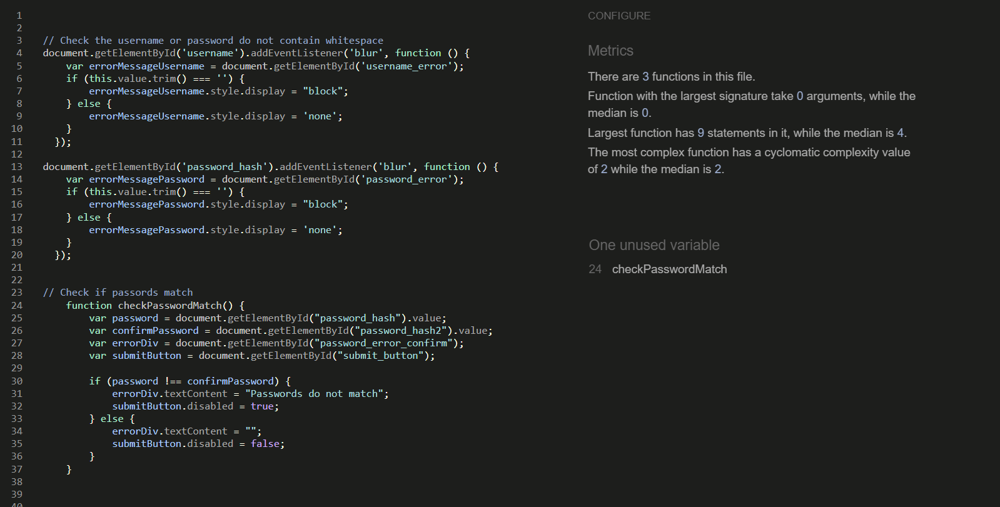

<h1 align="center">Little Explorers-Testing</h1>

[View the live website here - Little Explorers](https://little-explorers-c2ba86cc535f.herokuapp.com/)

---

<h2>Contents</h2

<small><i><a href='http://ecotrust-canada.github.io/markdown-toc/'>Table of contents generated with markdown-toc</a></i></small>

## Introduction

Testing is essential to ensure that the website functions properly, free from bugs, and that users can fully utilise its features before its release to the general market. This guarantees a positive user experience (UX) and encourages repeat visits from players.

Throughout the game development process, I relied on Chrome developer tools to assess page responsiveness across various screen sizes and address any encountered issues.

In troubleshooting, I utilised the console to log and monitor JavaScript code, aiding in resolving aspects of the game that did not perform as intended. All the test results detailed below are based on the [deployed site](https://little-explorers-c2ba86cc535f.herokuapp.com/).

---

## Automated Testing

### HTML Validation

[W3C](https://validator.w3.org/) was used to validate the HTML.

Minor code structure errors were addressed (such a extra closing div's) and invalid form describers were removed (e.g duplicate required elements, or required on elements hidden from the user).

Please note that the error messages which relate to a "Trailing slash on void elements" have been filtered as they are automatically added by the browser and are not a true error (as advised by the CI tutors).

As all validated screens look the same I am just displaying one here with the individual valid test results documented in the table below. 

HTML Validation Results Table

| **Page (html)**      | **Result**                            |
|----------------------|---------------------------------------|
| Add Holiday Types    | Passed- No errors or warnings to show |
| Add Recommendation   | Passed- No errors or warnings to show |
| Base                 | Passed- No errors or warnings to show |
| Contact              | Passed- No errors or warnings to show |
| Create Account       | Passed- No errors or warnings to show |
| Edit Holiday Types   | Passed- No errors or warnings to show |
| Edit Recommendation  | Passed- No errors or warnings to show |
| Holiday Types        | Passed- No errors or warnings to show |
| Index (Home)         | Passed- No errors or warnings to show |
| Profile              | Passed- No errors or warnings to show |
| Recommendations      | Passed- No errors or warnings to show |
| Sign In              | Passed- No errors or warnings to show |
| Users                | Passed- No errors or warnings to show |
| View Recommendations | Passed- No errors or warnings to show |
| 404 Error            | Passed- No errors or warnings to show |

### CSS Validation
CSS was validated using [W3C Jigsaw](https://jigsaw.w3.org/css-validator/).

CSS Validation Screenshot

### Javascript Validation

The JavaScript code was validated using [JSHint](https://jshint.com/). 

Please note, warnings relate the use of ES6/8 and are acceptable for the parameters of this project.

addRecommendation JS

1. Documented an "unsued" function CheckMaxLength. This is triggered from the HTML form.

createAccount JS

1. Documented an "unsued" function checkPasswordMatch. This is triggered from the HTML form.

maps-search JS

1. Documented undefined/unused variables - all are called elsewhere by Google Maps API.

maps-view JS

1. Documented undefined/unused variables - all are called elsewhere by Google Maps API.

maps JS

1. Documented undefined/unused variables - all are called elsewhere by Google Maps API.
2. Warnings relating to missing semi colons. All fixed. 
3. One variable unused (address) so removed. 

script JS

1. Documented undefined/unused variables - all are called elsewhere by Materialize elements.
2. Warnings relating to missing semi colons. All fixed.  

sendEmail JS

1. Documented undefined/unused variables - all are called elsewhere by emailJS in the contact form. 

### Python Validation

Python pep8 validation was done via [Code Institute's Python Linter](https://pep8ci.herokuapp.com/).

__init__ Python

1. Resolved issues included moving all imports at the top of file and correcting gaps/whitespace

Models Python

1. Resolved issues included correcting gaps/whitespace and retructuring to reduce line length. 

Routes Python

1. Resolved issues included correcting gaps/whitespace and retructuring to reduce line length.

